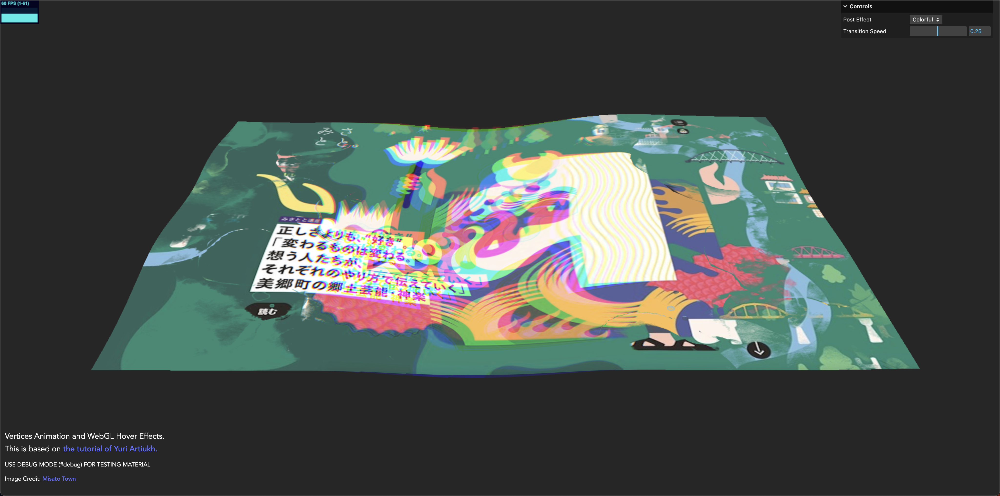

# Vertices Animation and WebGL Hover Effects

### Libraries

- Three.js : [v150](https://unpkg.com/browse/three@0.152.0/)
- Load GLSL with [glslify](https://github.com/glslify/glslify)

### References:
- Hover Effects Tutorial:
    - [Yuri Artiukh](https://tympanus.net/codrops/2020/04/14/interactive-webgl-hover-effects/)
