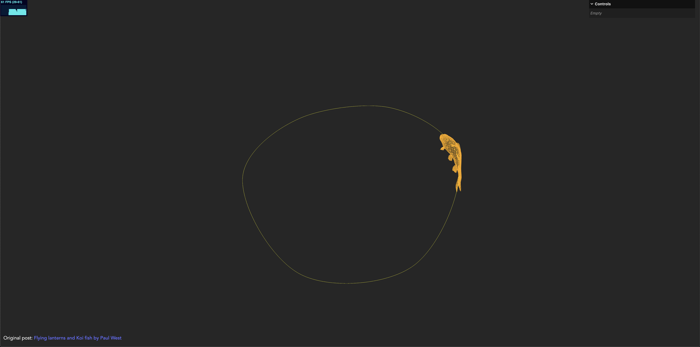

# Texture Animation

### Libraries

- Three.js : [v149](https://unpkg.com/browse/three@0.149.0/)
- GUI Debug

### References:
- [Texture Animation by Lee Stemkoski](http://stemkoski.github.io/Three.js/Texture-Animation.html)
- [computeFrenetFrames in threejs](https://stackoverflow.com/questions/29390462/three-js-how-to-use-the-frames-option-in-extrudegeometry)
- [Frenet–Serret formulas](https://en.wikipedia.org/wiki/Frenet%E2%80%93Serret_formulas)
- [BufferGeometry Instancing](https://threejs.org/examples/?q=inst#webgl_buffergeometry_instancing)
- [threejs dataTexture](https://dustinpfister.github.io/2022/04/15/threejs-data-texture/)
- [Textures](https://math.hws.edu/graphicsbook/c7/s3.html)
- [Pixel and Texel](https://discoverthreejs.com/book/first-steps/textures-intro/#pixel-and-texel)
