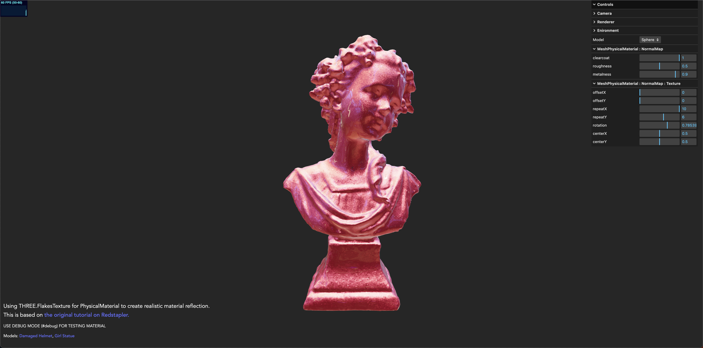

# GLSL/Shader Learning

#### Using FlakesTexture for PhysicalMaterial

### Libraries

- Three.js : [v150](https://unpkg.com/browse/three@0.150.1/)
- DRACO Decoder: [v150](https://unpkg.com/browse/three@0.150.1/examples/jsm/libs/draco/)
- Load GLSL with [glslify](https://github.com/glslify/glslify)

### References
