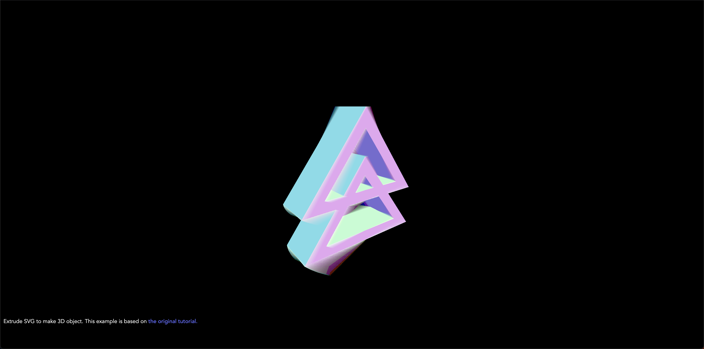

# Everything about Image :) 

#### Extrude SVG to make 3D object

### Libraries

- Three.js : [v150](https://unpkg.com/browse/three@0.150.1/)
- DRACO Decoder: [v150](https://unpkg.com/browse/three@0.150.1/examples/jsm/libs/draco/)
- Load GLSL with [glslify](https://github.com/glslify/glslify)

### References
- [Cartoon Outline Effect](https://medium.com/@joshmarinacci/cartoon-outline-effect-6c4e95545537)
- [three.js extrude SVG](https://muffinman.io/blog/three-js-extrude-svg-path/)
