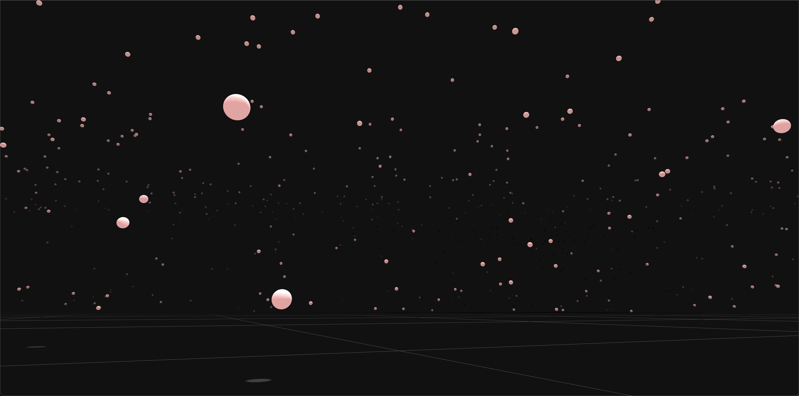

# Animate camera with gsap timeline

### Libraries

* Three.js : [v151](https://unpkg.com/browse/three@0.151.3/)
* gsap: v1.17

### TODO:
* Add physics.
* Update gsap timeline with addCallback event.

### References:
* [Awesome work of @clockmaker](https://codepen.io/clockmaker/pen/JdJmrP)
