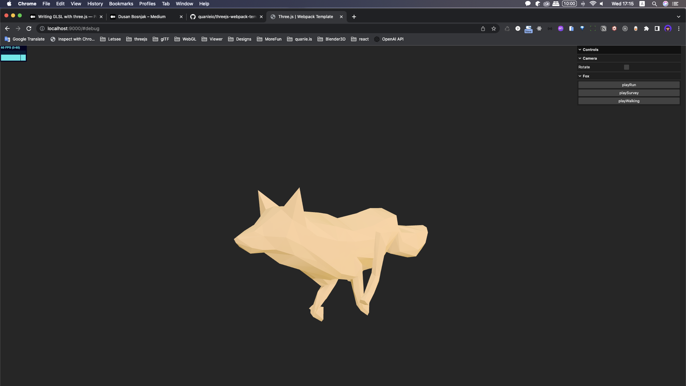

# Three.js & Webpack Template

## Description

- Three.js : [v150](https://unpkg.com/browse/three@0.150.1/)
- DRACO Decoder: [v150](https://unpkg.com/browse/three@0.150.1/examples/jsm/libs/draco/)
- Load GLSL with [glslify](https://github.com/glslify/glslify)
- GUI Debug
- Play GLB model animation.
