# Sketch of three.js

  

 

Some pieces of sketch made with three.js :heart:
  
<table>
    <tr>
        <td><a href="https://vertices-animation.netlify.app/">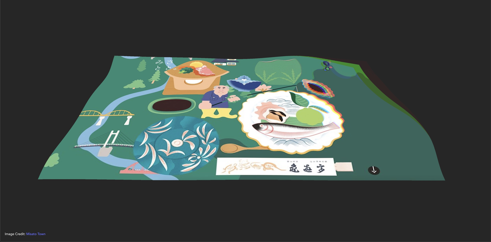</a></td>
        <td><a href="https://fbo-particles.netlify.app/">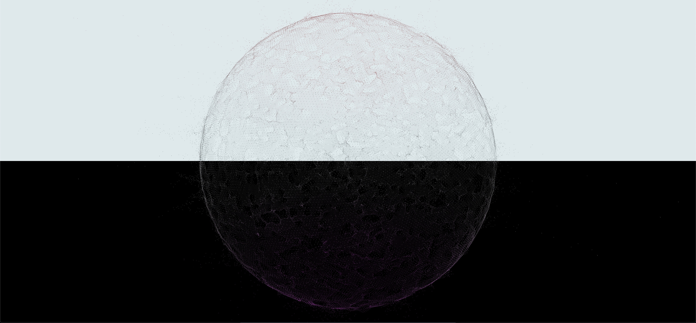</a></td>
        <td><a href="https://grain-material.netlify.app/">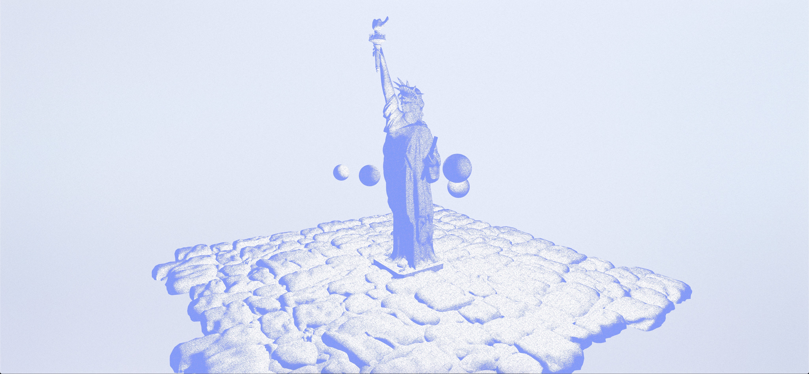</a></td>
    </tr>
    <tr>
        <td><a href="https://camera-on-wheel.netlify.app/">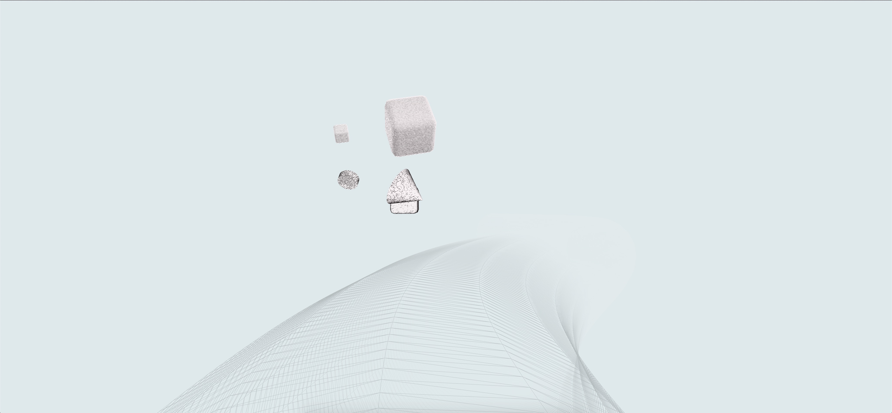</a></td>
        <td></td>
        <td><a href="https://pixel-to-particle.netlify.app/">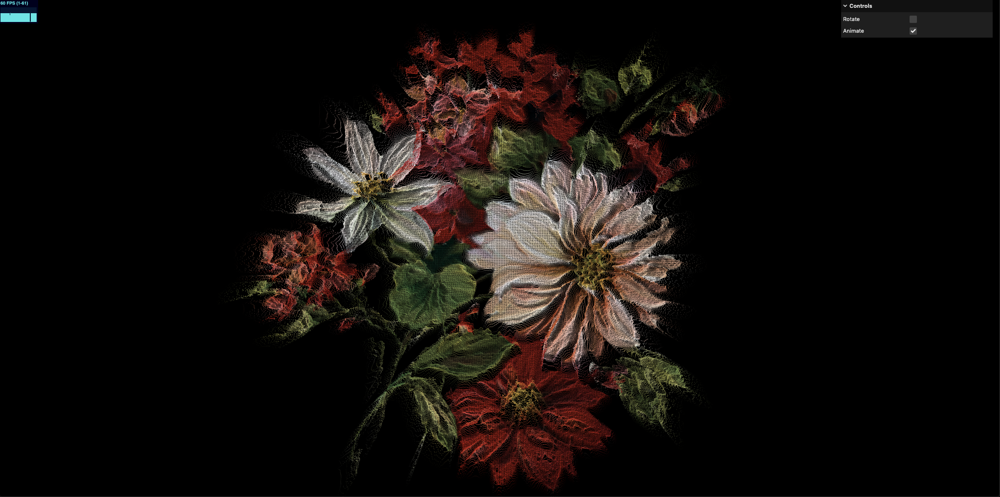</a></td>
    </tr>
    <tr>
        <td><a href="https://shadertoy-and-three.netlify.app/">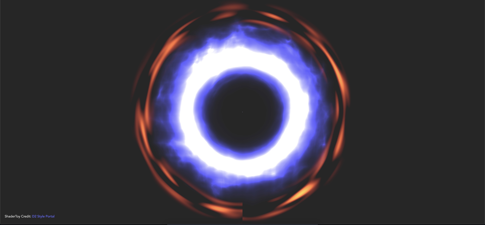</a></td>
        <td></td>
        <td></td>
    </tr>
    <tr>
        <td><a href="https://shader-glowing.netlify.app/">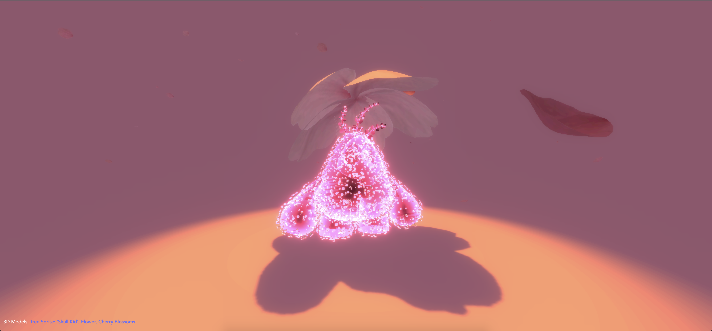</a></td>
        <td></td>
        <td><a href="https://translucent-sss.netlify.app/">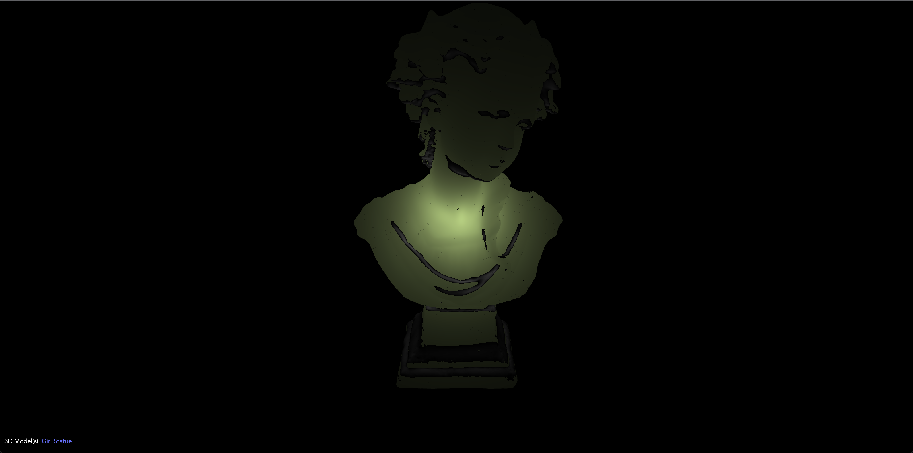</a></td>
    </tr>
    <tr>
        <td><a href="https://dispose-scene.netlify.app/">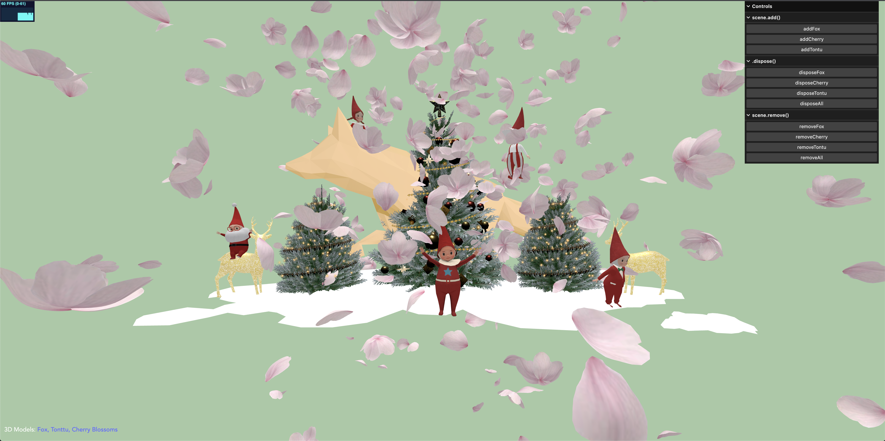</a></td>
        <td><a href="">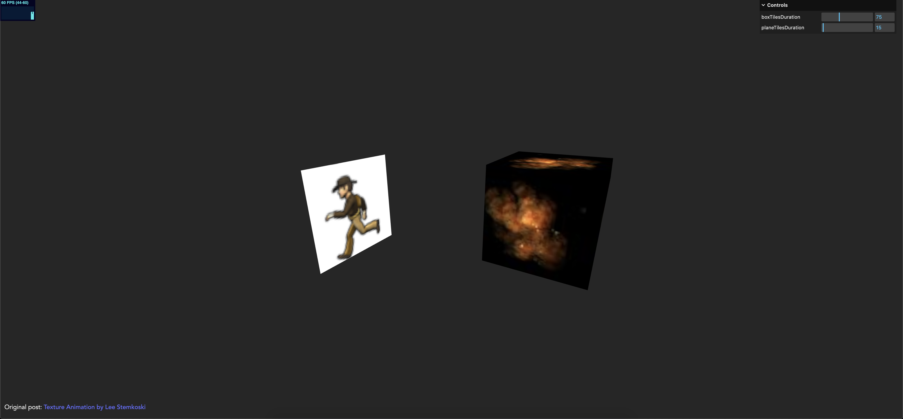</a></td>
        <td><a href="https://instancing-drawcalls.netlify.app/">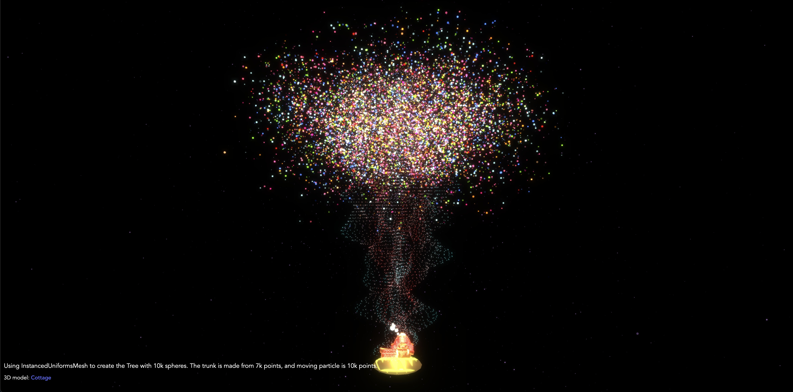</a></td>
    </tr>
    <tr>
        <td><a href="https://zoom-to-fit.netlify.app/">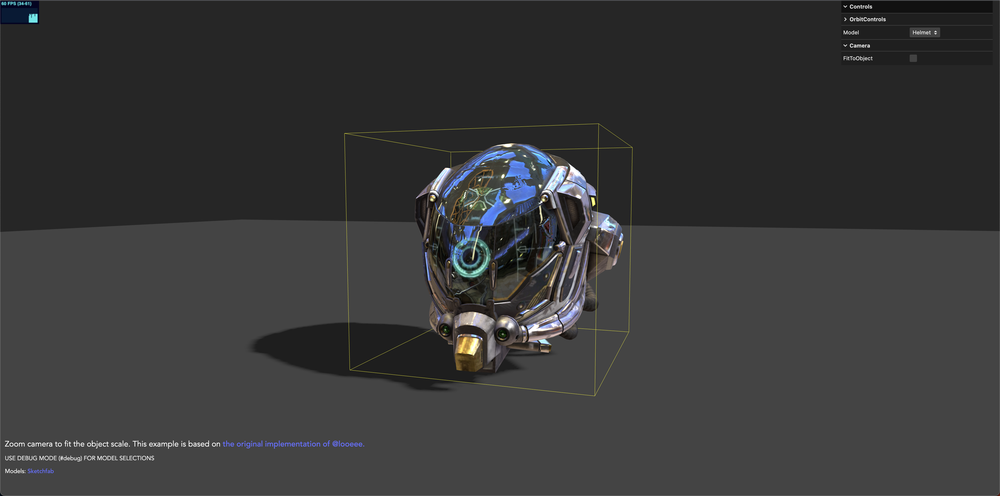</a></td>
        <td><a href="https://github.com/lehquan/sketch-lab/tree/master/24-learning-material">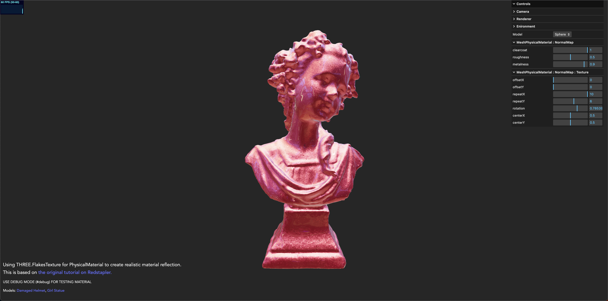</a></td>
        <td><a href="https://github.com/lehquan/sketch-lab/tree/master/24-learning-material">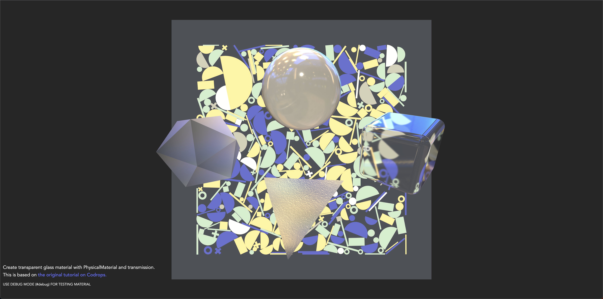</a></td>
  </tr>
</table>

## Libraries
- Three.js
- DRACO Decoder
- Load GLSL with [glslify](https://github.com/glslify/glslify)

## Misc

Follow Quan Le: [Web](https://quanleio.netlify.app/), [Hashnode](https://quanleio.hashnode.dev/)
