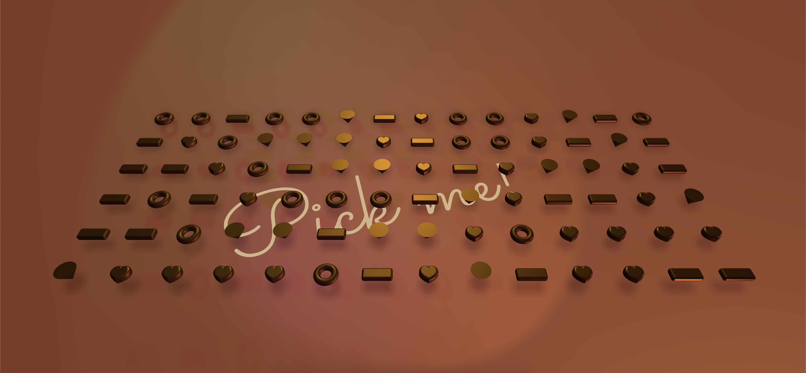

# Sketch of three.js

Some pieces of sketch made with three.js :heart:
  

<table>
  <tr>
    <td></td>
    <td></td>
    <td></td>
  </tr>
  <tr>
    <td></td>
    <td></td>
    <td></td>
  </tr>
  <tr>
    <td></td>
    <td></td>
    <td>To be continued...</td>
  </tr>
</table>

## Libraries
- Three.js : [v148](https://unpkg.com/browse/three@0.148.0/)
- DRACO Decoder: [v148](https://unpkg.com/browse/three@0.148.0/examples/jsm/libs/draco/)
- Load GLSL with [glslify](https://github.com/glslify/glslify)

## Misc

Follow Quan Le: [Web](https://quanleio.netlify.app/), [Hashnode](https://quanleio.hashnode.dev/)
