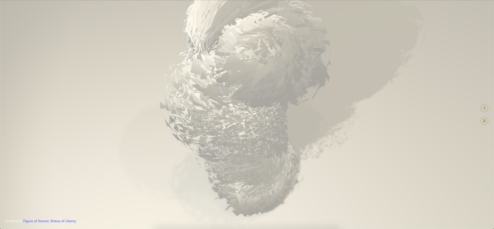

# Sketch of three.js

  

 

Some pieces of sketch made with three.js :heart:
  
<table>
    <tr>
        <td></td>
        <td></td>
        <td></td>
    </tr>
    <tr>
        <td></td>
        <td></td>
        <td></td>
    </tr>
    <tr>
        <td></td>
        <td></td>
        <td></td>
    </tr>
    <tr>
        <td></td>
        <td></td>
        <td></td>
    </tr>
    <tr>
        <td></td>
        <td></td>
        <td></td>
    </tr>
    <tr>
        <td></td>
        <td></td>
        <td></td>
  </tr>
</table>

## Libraries
- Three.js
- DRACO Decoder
- Load GLSL with [glslify](https://github.com/glslify/glslify)

## Misc

Follow Quan Le: [Web](https://quanleio.netlify.app/), [Hashnode](https://quanleio.hashnode.dev/)
