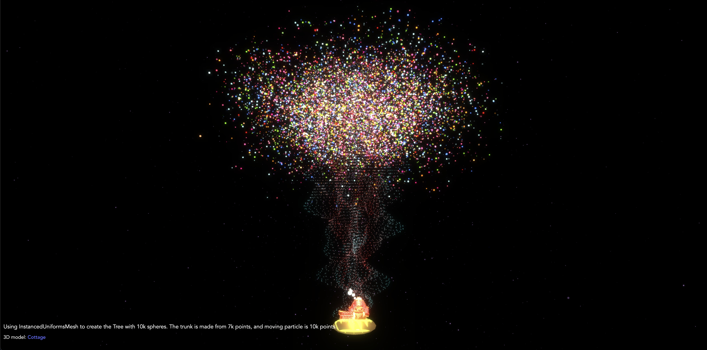

# Instancing and drawcalls

### Libraries

- Three.js : [v150](https://unpkg.com/browse/three@0.150.1/)
- GUI Debug

### References:
- [Rendering 100k spheres, instantiating and draw calls](https://velasquezdaniel.com/blog/rendering-100k-spheres-instantianing-and-draw-calls/)
