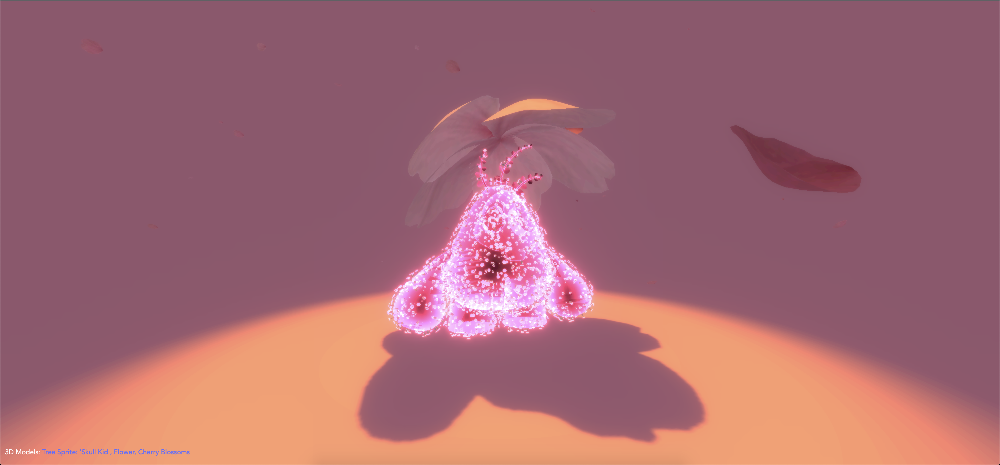

# Spring glowing

A study about [MeshSurfaceSampler](https://threejs.org/docs/#examples/en/math/MeshSurfaceSampler) and
glowing effect for material.

### Libraries

- Three.js : [v148](https://unpkg.com/browse/three@0.148.0/)
- DRACO Decoder: [v148](https://unpkg.com/browse/three@0.148.0/examples/jsm/libs/draco/)
- Load GLSL with [glslify](https://github.com/glslify/glslify)

### References:
- [Learn WebGL](http://learnwebgl.brown37.net/model_data/model_surface_normals.html)
- [Introducing Normals](https://webglfundamentals.org/webgl/lessons/webgl-3d-lighting-directional.html)
- [Surface Normals](https://youtu.be/DhSRvxVQ5HM)
- [Lighting in WebGL](https://developer.mozilla.org/en-US/docs/Web/API/WebGL_API/Tutorial/Lighting_in_WebGL)
