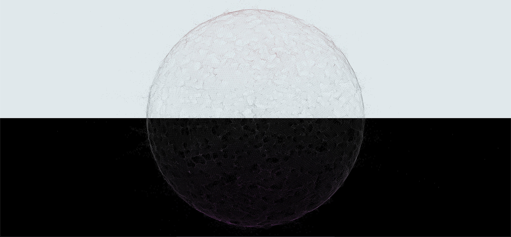

# GP GPU and Vertex animation

### Libraries
- Three.js : [v152](https://unpkg.com/browse/three@0.152.0/)

### References
- [three.js example](https://threejs.org/examples/?q=gpg#webgl_gpgpu_birds)
- [mrdoob](https://mrdoob.com/lab/javascript/webgl/particles/particles_zz85.html)
- [Original website](https://visualdata.org/partfemale)
- Tutorials:
    - [Yuri Artiukh](https://www.youtube.com/watch?v=oLH00MXTqNg&list=PLswdBLT9llbi7arATKwvAaJOAvE_HhWCy&index=10)
    - [Youpi Blog](https://barradeau.com/blog/?p=621)
