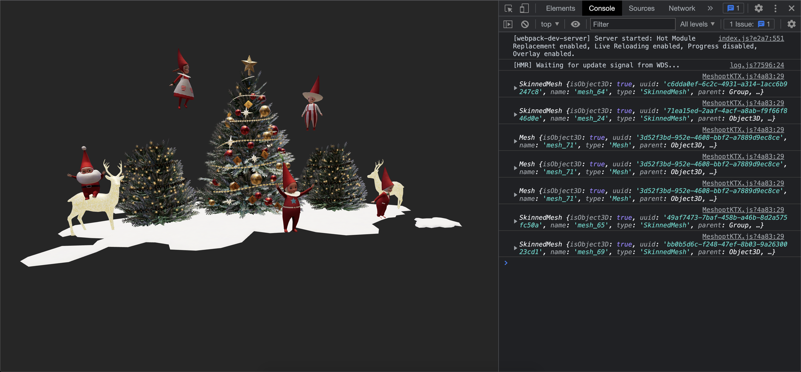

# Meshopt and Raycaster

## Screenshot

## Description

- Three.js : [v149](https://unpkg.com/browse/three@0.149.0/)
- DRACO Decoder: [v149](https://unpkg.com/browse/three@0.149.0/examples/jsm/libs/draco/)
- MeshoptDecoder: v149
- KTX2 Transcoder: [v149](https://unpkg.com/browse/three@0.149.0/examples/jsm/libs/basis/)
