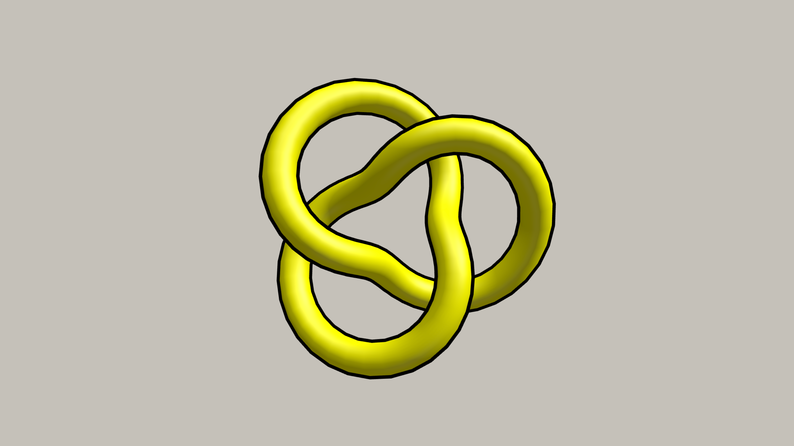

# Cartoon Outline

Fix the Normals of the material shader to make the outline.

## Screenshot

## Live

[Cartoon Outline](https://cartoon-outline.netlify.app/)

[R3F version](https://github.com/lehquan/cartoon-outline)
